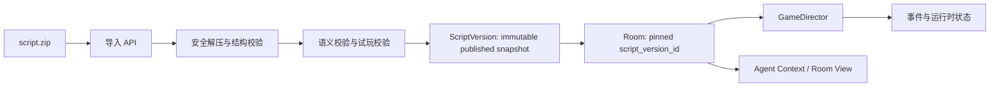

# 可导入剧本包架构方案

## 目标

新增剧本应当是导入内容，而不是开发、编译和部署新的 TypeScript。平台提供稳定的游戏能力与剧本包规范；一个 Room 创建时选择某个已发布的剧本版本，并冻结其内容快照。轮次、参与人数、角色、地点、线索、胜利条件和复盘内容全部由该快照驱动。

## 设计原则

1. **引擎与内容分离**：引擎只认识能力（讨论、搜证、投票、揭晓）和状态转移，不认识 `第七码头`、`introduction` 等业务 ID。
2. **版本不可变**：发布后的剧本版本不能原地修改；修订必须导入为新版本。运行中的 Room 始终使用创建时的快照，避免作者更新影响正在进行的游戏。
3. **声明式流程**：剧本声明 phase、入场条件、参与人范围、动作配额、完成规则和允许动作。GameDirector 根据声明通用执行。
4. **信息最小可见**：导入、校验、Room 查询、Agent 上下文和复盘各自使用不同投影，不能因读取完整剧本包造成角色秘密或真相泄露。
5. **受控扩展**：首版只支持平台预置 phase 类型与动作；不在剧本包中执行 JavaScript、SQL、Prompt 模板代码或任意插件。新玩法先由平台新增通用能力，再由剧本声明使用。

## 目标模型



### 持久化边界

新增 `script_packages` 与 `script_versions`（或等价表）。`script_versions` 至少保存：`script_id`、`version`、`content_hash`、`schema_version`、`status`（draft/validated/published/rejected）、原始 ZIP 存储位置、规范化 `definition_json`、导入报告和时间戳。

Room 保留 `script_version_id`，但该 ID 应指向数据库的不可变版本主键而非 `${id}@${version}` 字符串。创建 Room 时读取已发布版本并在同一事务中钉住它；Room 运行期间所有查询只经该版本读取。

角色、地点、线索可以先存于 `definition_json`，以 version ID 作为全局命名空间；若将来需要运营检索、素材复用或大规模统计，再拆为 `script_roles`、`script_clues` 等只读版本化表。不要把运行态的 `clue_holdings` 与剧本定义混在一起。

## 剧本包规范 v1

使用 ZIP，UTF-8 编码，根目录必须为一个名为 `<script-id>/` 的目录。禁止符号链接、绝对路径、`..` 路径、重复条目和未声明文件。允许的文件如下：

```text
harbor-at-midnight/
  manifest.json                 # 必需：包身份、版本、入口与摘要
  game.json                     # 必需：公开背景、角色、地点、阶段、结局
  assets/
    cover.webp                  # 可选：封面
    clues/
      rope-photo.webp           # 可选：只由 game.json 的 asset 引用
  README.md                     # 可选：给作者的说明，不进入玩家上下文
```

首版采用 JSON Schema 校验的 JSON，便于 ZIP 导入、哈希、Diff、Agent 生成与跨语言实现。YAML 可在创作工具层支持，但导入前必须规范化为 JSON，不作为平台运行时格式。

### manifest.json

```json
{
  "schemaVersion": "1.0",
  "id": "harbor-at-midnight",
  "version": "1.0.0",
  "title": "午夜港湾",
  "description": "一场暴雨中的六人推理。",
  "entry": "game.json",
  "minPlayers": 4,
  "maxPlayers": 6,
  "defaultLocale": "zh-CN",
  "coverAsset": "assets/cover.webp"
}
```

`id` 使用稳定的 kebab-case；`version` 使用 SemVer；`minPlayers/maxPlayers` 必须可由角色及席位策略满足。若首版只支持“所有角色都参与”，二者均等于角色数，避免错误承诺可伸缩人数。

### game.json 的核心形状

```json
{
  "publicContext": "所有玩家可见的案件背景。",
  "roles": [{
    "id": "detective-lin",
    "name": "林舟",
    "publicProfile": "……",
    "private": { "story": "……", "facts": ["……"], "secrets": ["……"], "goals": ["……"] },
    "deceptionPolicy": { "mayHideOwnFacts": true, "mayLieAboutOwnActions": true }
  }],
  "locations": [{ "id": "dock", "name": "旧码头", "description": "……" }],
  "phases": [{
    "id": "opening",
    "kind": "discussion",
    "discussion": { "mode": "ordered", "requiredAction": "introduce", "turnOrder": "random" },
    "completion": { "kind": "each_participant_completed" },
    "allowedActions": ["send_message", "yield_turn"]
  }, {
    "id": "investigation-a",
    "kind": "investigation",
    "investigation": { "actionsPerPlayer": 1, "searchTargets": "locations" },
    "completion": { "kind": "each_participant_completed" },
    "allowedActions": ["search_clue", "reveal_clue", "keep_clue_private", "finish_search"]
  }, {
    "id": "accusation",
    "kind": "vote",
    "vote": { "target": "role", "visibility": "sealed", "maxSelections": 1 },
    "completion": { "kind": "each_participant_voted" },
    "allowedActions": ["submit_vote"]
  }, {
    "id": "reveal",
    "kind": "reveal",
    "completion": { "kind": "immediate" },
    "allowedActions": []
  }],
  "clues": [{
    "id": "torn-cuff",
    "phaseId": "investigation-a",
    "source": { "kind": "location", "id": "dock" },
    "content": "……",
    "distribution": { "kind": "per_player_random", "revealPolicy": "owner_decides" }
  }],
  "outcome": { "type": "single_murderer", "murdererRoleId": "…", "truth": "……" }
}
```

`requiredAction: introduce` 是能力语义，不是对 phase ID 的特殊判断。Agent 指令、UI 标题和 Director 规则都读取该字段。首版可将 `kind` 限定为 `discussion`、`investigation`、`vote`、`reveal`；未来的交易、合作解谜、时间限制等玩法通过升级 schema 及通用引擎添加，而不是让剧本包携带代码。

## 运行时改造要点

`GameDirector` 读取当前 phase 的 `kind + completion + participation + configuration`，生成与该能力通用的状态。`PlayerRoundStateRecord` 不应继续累积特定阶段字段（例如 `searchActionsUsed`、`discussionFinished`）；采用 `state_json` 或受控的 `phase_player_states`，由 phase kind 的通用状态适配器读写。保留事件溯源记录以恢复与审计。

`RoomCommandService` 对每个动作验证：当前 phase 是否声明该动作、玩家是否在参与范围内、动作参数是否可引用当前版本中的对象、配额与完成规则是否满足。线索选择应读 `clue.phaseId` 和 `distribution`，不假定地点一定存在或一人一次一定适用。

`PlayerAgentContextBuilder` 只注入当前角色私有投影、当前阶段说明、当前可操作对象、个人私有线索和公开投影。`introduction`、地点搜证额度、投票目标等提示改为读 phase 配置；真相只在 `outcome/review` 阶段进入对应响应，绝不加入游戏中 Agent 上下文。

Web 继续只消费 `RoomView`，但视图应返回 phase 的展示语义与可用动作，而不是前端根据 `RoundType` 和固定 ID 推导界面。平台默认 UI 可覆盖 v1 phase kind；剧本可提供标题和说明，不能提供任意前端代码。

## v1 的自由度边界与流程契约

剧本包不是任意规则编程语言。平台的可配置性是受控 DSL：作者可组合 phase 和参数，不能增加 phase kind、动作、状态转移函数或 Agent 系统提示词。这样既能支持不同故事节奏，也能做导入时的完成性校验。

### 平台硬约束

1. 第一 phase 必须是 `discussion`，且必须是 `mode: ordered`、`requiredAction: introduce`、`turnOrder: random`。每个参与者恰好一次公开介绍，介绍轮中不允许提问、搜证或投票。该约束由 package validator 检查，绝不通过检查某个特定 phase ID 实现。
2. 最后两项必须为 `vote` 后接 `reveal`；`reveal` 是唯一终局 phase。v1 的 vote 为“每位参与者对一名 role 的密封投票”。
3. 必须至少有一个 investigation phase，以及投票前至少一个非开场讨论 phase。
4. `phases` 总数限制为 5–10；其中 discussion 为 2–5 个、investigation 为 1–3 个。该上限是产品节奏约束，而不是引擎能力上限。
5. 任何 phase 都必须拥有一个平台认识的完成条件，且所有参与者都必须有至少一条合法的完成路径。

### discussion 受控参数

```json
{
  "kind": "discussion",
  "discussion": {
    "mode": "free",
    "minPublicActionsPerPlayer": 0,
    "maxPublicActionsPerPlayer": 4,
    "maxQuestionsPerPlayer": 2,
    "allowPass": true,
    "allowFinish": true,
    "pacing": {
      "softLimitMinutes": 8,
      "softLimitPublicMessages": 30,
      "softLimitAgentActivations": 45,
      "hardLimitMinutes": 12
    }
  },
  "completion": { "kind": "all_finished_and_no_pending_questions" }
}
```

`min/maxPublicActionsPerPlayer` 与 `maxQuestionsPerPlayer` 是防垄断配额。`pass` 只结束一次 AI activation；`finish_round` 才永久结束该玩家在当前讨论 phase 的参与。软阈值只提示收敛，硬时限才触发确定性收口：停止创建问题、要求未结束玩家在最后行动窗口中完成，然后自动拒绝遗留问题并推进。这样不会让 Agent 或真人无限对话，也不会由 Scheduler 代替角色决定内容。

### investigation 与 vote 受控参数

- investigation：`actionsPerPlayer` 限定为 1–3；`searchTargets` 只允许平台实现的 `locations`、`characters` 或 `objects`；线索分发只允许受控枚举（例如 `per_player_random`、`global_unique`）。
- vote：目标只允许已参与 role；`maxSelections` 在 v1 固定为 1；全员投票才完成。
- 线索的出现 phase 必须在 vote 前；标记为 `requiredForOutcome` 的线索必须在配额与分发策略下存在可发现路径。

由此，作者能控制“讨论几轮、哪轮可问答、每轮多长、搜几次、线索何时出现”，但不能写出让 Room 无法恢复、无法完成或绕开信息隔离的规则。

## 导入与发布流程

1. 管理员上传 ZIP；服务端使用流式读取并施加文件数量、解压总大小、单文件大小与压缩比上限。
2. 安全解压至随机隔离目录，检查根目录和白名单文件；计算每个文件和规范化定义的 SHA-256。
3. 用 JSON Schema 校验结构，再执行语义校验：ID 唯一性、引用完整性、阶段拓扑、角色数、动作与 phase kind 兼容性、线索可达性、结局引用、素材路径及 MIME/尺寸。
4. 执行确定性试玩校验：建立最小 Room，枚举阶段推进，验证每个角色/必需玩家均能完成、投票和揭晓可达、没有不可达线索或永远无法结束的 phase。
5. 保存为 `validated` 草稿并返回结构化报告；通过预览环境人工确认 Agent 提示词和玩家 UI。
6. 发布时以内容哈希去重，生成不可变 `published` 版本；同 `id + version` 只能发布一次。

导入失败不得留下可被创建 Room 的半成品。资产应由内容哈希命名且在发布事务成功后才可被引用；删除草稿使用可追踪的延迟清理。

## 创作支持与 Create Skill

建议仓库增加 `skills/murder-mystery-script-creator/SKILL.md`，并随版本维护 `assets/script-package-v1-template/` 与 `schemas/script-package-v1.schema.json`。Skill 的输入是故事梗概与人数约束，输出是一个 ZIP-ready 目录和校验报告，不直接调用生产导入接口。

Skill 的硬性检查表：

- 先确认玩家数、嫌疑人范围、核心谜题、角色动机、关键时间线与可推理闭环；
- 为每个角色生成公开卡和私密卡，保证其他角色秘密不会复制进去；
- 每个结论至少有独立线索链支撑，红鲱鱼不能造成无法判定；
- 每条线索关联可达 phase 与合法来源，且配额下至少存在发现路径；
- 生成 manifest/game/assets/README，并调用平台提供的本地 validator；
- 对 validator 的错误逐项修复后才产出导入包；
- 明确标注 AI 生成内容需要人工做版权、事实、敏感内容与可玩性审核。

## 安全、运营与兼容

- ZIP 仅是数据和媒体，拒绝可执行文件、外链、HTML/SVG 活动内容及路径穿越；扫描媒体 MIME，不只相信扩展名。
- 将作者、导入者、内容哈希、校验器版本、发布人和导入报告写入审计日志。
- 为 `schemaVersion` 建立迁移器。新引擎要继续支持已发布旧 schema，直到明示下线；Room 运行期间不得自动迁移版本。
- `runtimeRevision` 只表示引擎版本，`script_version_id` 表示内容版本；二者分开校验。
- 使用脚本级权限：草稿可预览，只有已发布版本能创建 Room；若引入多租户，资产、脚本与房间均以租户隔离。

## 验收标准

1. 新剧本从 ZIP 导入、通过校验、发布并出现在 `/api/scripts`，全过程不改动或重新部署剧本 TypeScript。
2. 两个 Room 分别使用不同角色数、阶段数、搜证配额和线索配置时，均能完成，且互不串内容。
3. 修改/重新上传同一剧本产生新版本；历史 Room 的回放、复盘和 Agent 上下文保持原版本内容。
4. 对无效引用、不可完成 phase、Zip Slip、压缩炸弹、超限素材、重复版本均返回精确错误且不产生可用版本。
5. 测试证明引擎与提示词不再检查任何具体剧本/phase ID，特别是 `seventh-pier` 与 `introduction`。
